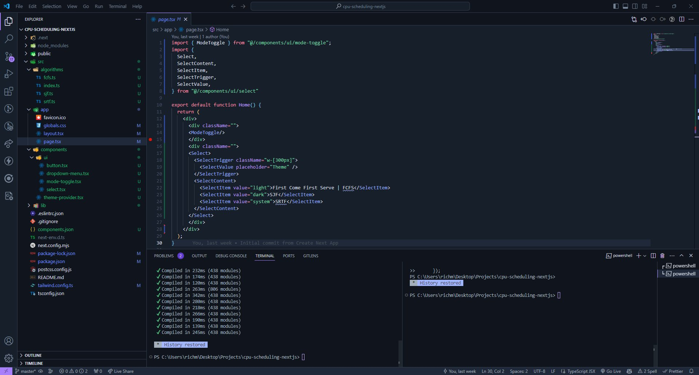
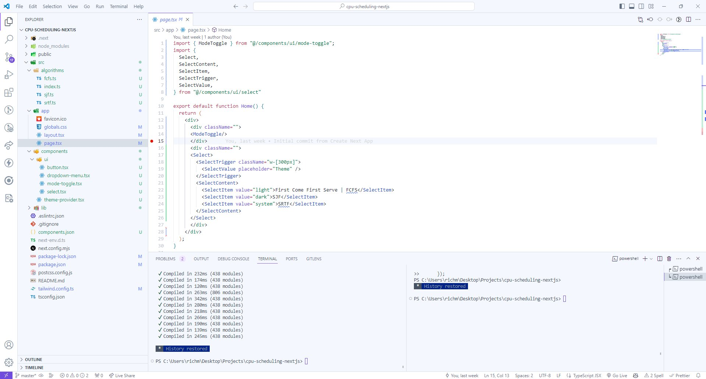

<h1 align="center">
  Luna Dark Pro Theme For VSCode
</h1>

  A premium Visual Studio Code theme designed to minimize distractions.

## Luna Pro Midnight

## Luna Pro Starlight

1. Open **Extensions** sidebar panel in VS Code. `View → Extensions`
2. Search for `Luna Dark Pro`
3. Click **Install** to install it
4. Click **Reload** to reload the editor
5. Code > Preferences > Color Theme > **Luna Dark Pro**

## Theming Reference

[VS Code Theme Color Reference](https://code.visualstudio.com/docs/getstarted/theme-color-reference)

[VS Code Theme Documentation](https://code.visualstudio.com/docs/extensions/themes-snippets-colorizers)

[VS Code Publishing Extensions](https://code.visualstudio.com/docs/extensions/publish-extension)

